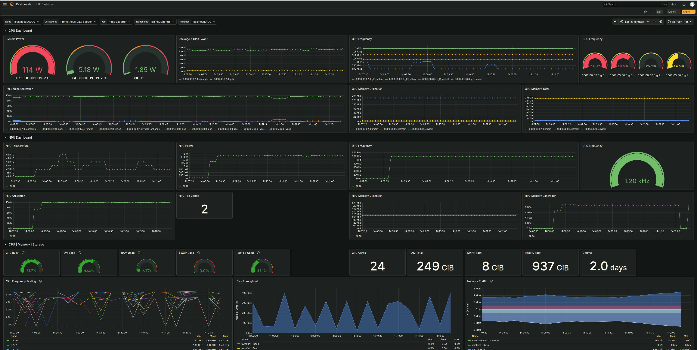
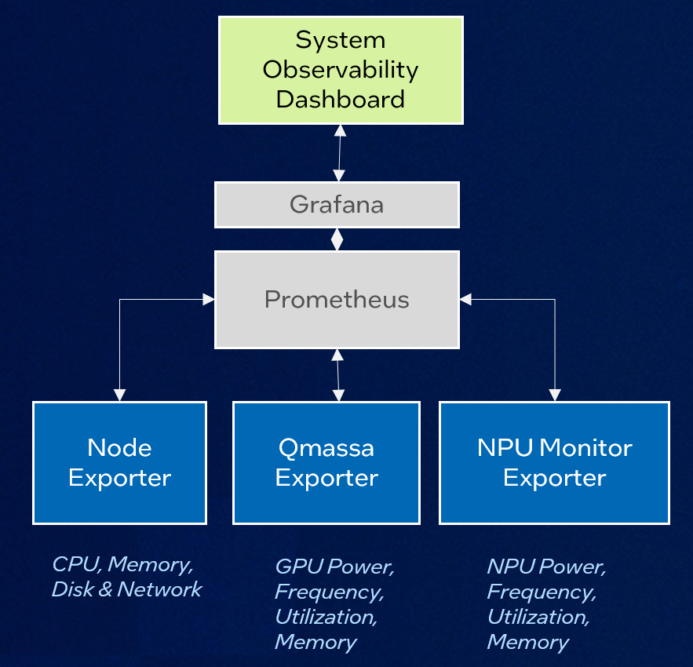

# Overview

This is personal end-to-end observability dashboard that pull together below open-source projects
to allow me to monitor Intel CPU, GPU and NPU behaviour during day-to-day work.

Disclaimer: there is no warranty in adopting this dashboard.

Being a dashboard built on-top of Grafana/Prometheus, you may modify the feel and look according
to your preference.

# Example Grafana Dashboard




# Software Architecture



# Setup
```bash
REPODIR=/home/user/repos
```

## Node Exporter
Note: Adjust below version accordingly if you need new version:
```bash
cd $REPODIR
wget https://github.com/prometheus/node_exporter/releases/download/v1.10.2/node_exporter-1.10.2.linux-amd64.tar.gz
tar -xvf node_exporter-1.10.2.linux-amd64.tar.gz

# Run node-exporter on a new terminal
cd $REPODIR/node_exporter-1.10.2.linux-amd64
./node_exporter --collector.systemd --collector.processes

# Test node-exporter on another terminal
curl http://localhost:9100/metrics
```

## Qmassa

Project https://github.com/ulissesf/qmassa.git has qmassa (TUI) an qmmd (metrics exporter) for Prometheus.

```bash
# Install from cargo
# Below qmmd and qmassa are installed under ~/.cargo/bin/
cargo install --locked qmmd qmassa

# Make qmmd and qmassa available to system / sudo
sudo ln -sf /home/bong5/.cargo/bin/qmassa /usr/local/bin/qmassa
sudo ln -sf /home/bong5/.cargo/bin/qmmd /usr/local/bin/qmmd

# Look-up PCI-ID for intel iGPU and dGPU using lspci
lspci | grep VGA
# Example of
---
00:02.0 VGA compatible controller: Intel Corporation YYYY [Intel Graphics]
05:00.0 VGA compatible controller: Intel Corporation Device XXXX
---

# Run qmmd for iGPU on a new terminal (Assume port 9200 for iGPU)
sudo qmmd -d 0000:00:02.0 -p 9200

# Run qmmd for dGPU on a new terminal (Assume port 9200 for dGPU)
sudo qmmd -d 0000:05:00.0 -p 9300

# Confirm node exporter for iGPU and dGPU are running (on another terminal)
curl http://localhost:9200/metrics
curl http://localhost:9300/metrics
```

## NPU Monitoring Tool
Project https://github.com/open-edge-platform/edge-ai-libraries/tree/main/tools/npu-monitor-tool contain
TUI for NPU monitoring.

[WIP] The PR for Prometheus enabling is https://github.com/open-edge-platform/edge-ai-libraries/pull/2110/commits

```bash
# Assuming the PR has been merged
cd edge-ai-libraries/tools/npu-monitor-tool
pip install -r requirements.txt

# Run npu-metrics-exporter on a new terminal (Assume port 8000 for NPU)
sudo env "PATH=$PATH" gunicorn -w 1 -b localhost:8000 npu-metrics-exporter:app

# Confirm node exporter for NPU (on another terminal)
curl http://localhost:8000/metrics
```

## Prometheus

Below prometheus yaml config is at [prometheus.yml](./prometheus.yml)

```bash
cd $REPODIR
wget https://github.com/prometheus/prometheus/releases/download/v3.8.1/prometheus-3.8.1.linux-amd64.tar.gz
tar -xvf prometheus-3.8.1.linux-amd64.tar.gz

cd $REPODIR/prometheus-3.8.1.linux-amd64
nano prometheus.yml
---
# my global config
global:
  scrape_interval: 15s # Set the scrape interval to every 15 seconds. Default is every 1 minute.
  evaluation_interval: 15s # Evaluate rules every 15 seconds. The default is every 1 minute.
  # scrape_timeout is set to the global default (10s).

# Alertmanager configuration
alerting:
  alertmanagers:
    - static_configs:
        - targets:
          # - alertmanager:9093

# Load rules once and periodically evaluate them according to the global 'evaluation_interval'.
rule_files:
  # - "first_rules.yml"
  # - "second_rules.yml"

# A scrape configuration containing exactly one endpoint to scrape:
# Here it's Prometheus itself.
scrape_configs:
  # Node Exporter
  - job_name: "node exporter"
    scheme: http

    static_configs:
      - targets: ['localhost:9100']

  - job_name: "qmmd exporter iGPU"
    scheme: http

    static_configs:
      - targets: ['localhost:9200']

  - job_name: "qmmd exporter dGPU"
    scheme: http

    static_configs:
      - targets: ['localhost:9300']

  - job_name: "NPU Metrics Exporter"
    scheme: http

    static_configs:
      - targets: ['localhost:8000']
---

# Run Prometheus on another terminal
./prometheus --config.file=./prometheus.yml
```

To check Promethues, use web-browser http://localhost:9090/query and look for metrics
with prefix, e.g node_, qmmd_, npu_

## Grafana
Assume your on Ubuntu 24.04:
```bash
# https://grafana.com/docs/grafana/latest/setup-grafana/installation/debian/
$ sudo mkdir -p /etc/apt/keyrings/
$ wget -q -O - https://apt.grafana.com/gpg.key | gpg --dearmor | sudo tee /etc/apt/keyrings/grafana.gpg > /dev/null

$ echo "deb [signed-by=/etc/apt/keyrings/grafana.gpg] https://apt.grafana.com stable main" | sudo tee -a /etc/apt/sources.list.d/grafana.list
$ sudo apt-get update
$ sudo apt-get install grafana

# Add proxy setting in /etc/default/grafana-server
$ sudo cat << EOF > /etc/default/grafana-server
HTTP_PROXY=http://<PROXY_SERVER>:<PORT>
HTTPS_PROXY=http://<PROXY_SERVER>:<PORT>
NO_PROXY=localhost,127.0.0.1
EOF

# Enable and start Grafana server
$ sudo systemctl enable grafana-server
$ sudo systemctl restart grafana-server
$ sudo systemctl status grafana-server
```

## Open Grafana Webpage
- Connect to Grafana Server using http://localhost:3000
- Use initial login/password  = admin/admin
- Update Grafana server with new password

## Create New Dashboard for E2E Observability Dashboard
In Grafana page, create new dashboard and import the sample E2E metrics dashboard in
[grafana-e2e-dashboard.json](./grafana-e2e-dashboard.json)
